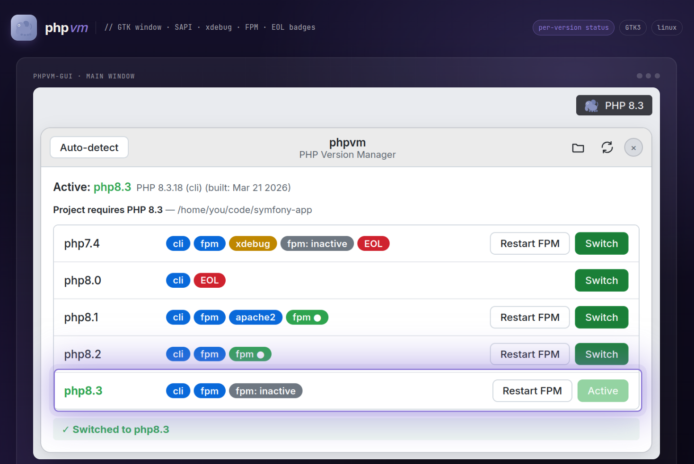
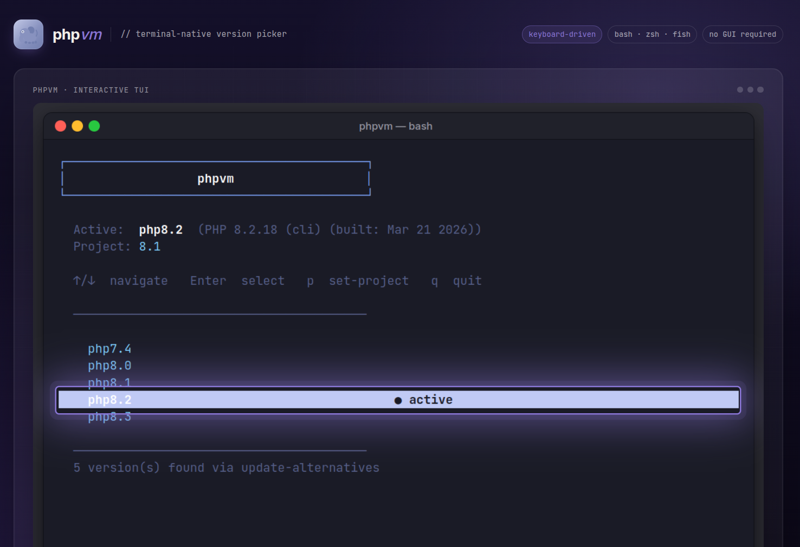
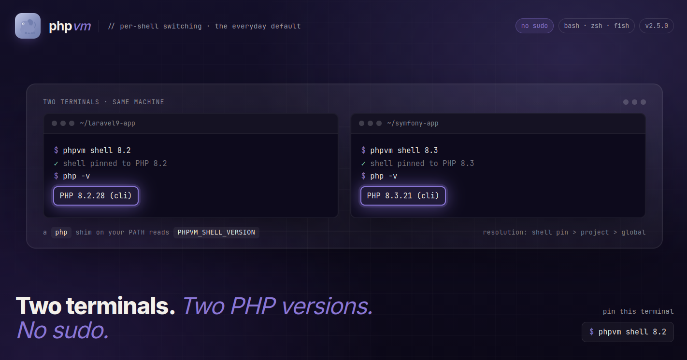
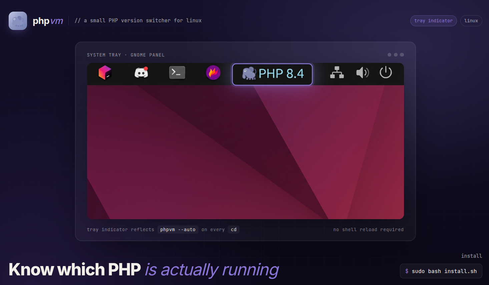
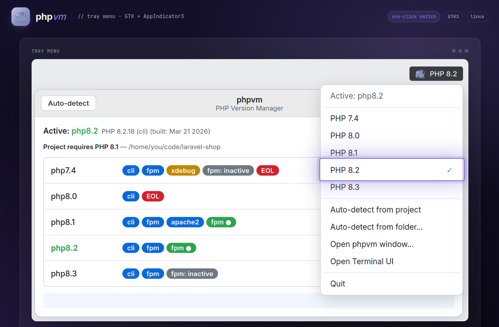

<div align="center">


# phpvm

A small PHP version manager for Linux. TUI in the terminal, optional system tray app, per-shell switching, and a `cd`-hook that picks the right PHP for the project you just stepped into.

If you've been juggling `update-alternatives --set php` by hand every time you switch between a Laravel 9 app on 8.1 and a fresh Symfony repo on 8.3, this is for you.


</div>

<div align="center">
  
  <p><em>One-click switching with SAPI, xdebug, FPM, and EOL badges.</em></p>
</div>

## What it does

- Interactive TUI version picker, arrow keys, Enter, done.
- A tray icon (and a separate GTK window if you'd rather not live in the panel) with per-version badges: which SAPIs are available, whether xdebug is loaded, whether FPM is running, whether the version is EOL.
- `.php-version` (or `composer.json`'s `require.php`) drives a per-project version. Walks up the tree like `nvm` does.
- A `cd`-hook for bash / zsh / fish that runs `phpvm --auto` so the right PHP is loaded by the time the prompt comes back.
- Per-shell switching: `phpvm shell 8.2` pins a version for the current terminal only via a `php` shim on `PATH`. Two terminals can run two PHP versions at once, no sudo.
- `phpvm install <ver>` adds a new PHP version straight from the upstream repo (Ondřej Surý's PPA on Ubuntu, deb.sury.org on Debian) without hand-running `apt install`.
- An installer that asks the obvious questions (CLI? GUI? wire up the shell hook? passwordless sudo?) and an uninstaller that backs up your shell rc before touching it.

Global switches use `update-alternatives --set php`, installs drive the upstream PPA, and per-shell pins use a tiny `php` shim on your `PATH`. Nothing exotic.

## Installing

One-liner (no local clone needed, the installer bootstraps itself by fetching the repo into a temp dir, then cleans up):

```bash
curl -fsSL https://raw.githubusercontent.com/rijverse/phpvm/main/install.sh | sudo bash
```

Or clone and run it interactively:

```bash
git clone https://github.com/rijverse/phpvm.git
cd phpvm && sudo bash install.sh
```

The installer is interactive even under `curl ... | sudo bash`. It reads prompts directly from `/dev/tty` so the pipe doesn't swallow them. Pick CLI, GUI, or both, then say yes/no to the shell hook and the sudoers rule. Falls back to non-interactive defaults only when there is genuinely no controlling terminal (headless CI, `nohup`, etc.).

> Already-open terminals won't have the shell hook yet (new ones do). To activate it in the terminal you ran the installer from, run `source ~/.bashrc` (or `~/.zshrc` / `~/.config/fish/config.fish`). Without this, `phpvm shell <ver>` will print a "needs the shell wrapper" hint until you reload.

Pin a specific tag or branch:

```bash
curl -fsSL https://raw.githubusercontent.com/rijverse/phpvm/main/install.sh | sudo PHPVM_REF=v2.3.2 bash
```

To remove it, see [Uninstalling](#uninstalling) below.

### Upgrading

```bash
phpvm --self-update
```

That pulls the latest from the repo URL captured at install time and re-runs the installer in `--upgrade` mode, same install paths, same CLI/GUI choice, doesn't re-prompt for sudoers or the shell hook.

If you installed from a tarball (no recorded URL), you can pass one explicitly, optionally with a tag or branch:

```bash
phpvm --self-update https://github.com/rijverse/phpvm.git
phpvm --self-update https://github.com/rijverse/phpvm.git v2.2.0
```

If you're working from a local clone you can re-run the installer directly with `sudo bash install.sh --upgrade` (alias `-U`). It reads `${HOOK_DIR}/install.meta`, replicates your prior CLI/GUI choice, and skips the shell-hook and sudoers prompts. Same code path `--self-update` runs after it pulls.

### What you need

- Linux with `update-alternatives`. Tested on **Ubuntu 20.04 / 22.04 / 24.04** in CI; **Debian 11+** and Ubuntu derivatives (Mint, Pop!_OS, Zorin, elementary) on the equivalent releases should work too.
- Bash 4.3+ (uses `local -n`).
- For the GUI: `python3-gi`, GTK3, AppIndicator3. The install command is in the GUI section below.

## CLI
Keyboard-driven picker right where you live. <kbd>↑</kbd>/<kbd>↓</kbd> to move, <kbd>Enter</kbd> to pin the current shell, <kbd>g</kbd> for a system-wide switch, <kbd>p</kbd> to pin the project, <kbd>q</kbd> to bail.



| Command | What it does |
|---|---|
| `phpvm` | Opens the TUI |
| `phpvm --list` | Lists installed PHP versions |
| `phpvm --current` | Shows the effective version plus the shell / project / global breakdown |
| `phpvm shell 8.2` | Switches **this terminal only**, no sudo (see [Per-shell switching](#per-shell-switching)) |
| `phpvm shell --unset` | Drops the per-shell pin |
| `phpvm local 8.2` | Pins the project: writes `.php-version`, no sudo |
| `phpvm global 8.2` | Switches the system default via `update-alternatives` (sudo) |
| `phpvm install 8.3` | Installs PHP 8.3 from Ondřej Surý's repo (see [Installing PHP versions](#installing-php-versions)) |
| `phpvm --auto` | Reads `.php-version` / `composer.json` and switches |
| `phpvm --auto --print [dir]` | Prints the resolved project PHP version without switching |
| `phpvm --enable-hook [shell]` | Adds the shell hook + shim to your rc |
| `phpvm --disable-hook [shell]` | Removes it (rc is backed up first) |
| `phpvm --window` | Launches the GTK picker window, then frees the terminal |
| `phpvm-gui` | Tray applet (see [The GUI](#the-gui)) |
| `phpvm-gui --window` | Standalone GTK picker window, no tray |
| `phpvm --self-update` | Re-runs the installer against the latest commit |
| `phpvm --doctor` | Full diagnostic: CLI install, PHP runtimes, FPM, sudoers, shell hook, shim, GUI, project |
| `phpvm --help` | Everything else |

`--set` is kept as an alias for `global`, and `--set-project` for `local`, so old muscle memory and scripts keep working. Vim users get <kbd>k</kbd>/<kbd>j</kbd> too.

## Installing PHP versions

`phpvm install` drives the upstream PHP repos so you don't have to add a PPA and `apt install` by hand:

```bash
phpvm install 8.3            # cli + common + fpm
phpvm install 8.3 --minimal  # cli + common, no fpm
phpvm install 8.3 --with curl,mbstring,xml   # add extensions
phpvm install 8.3 --use      # install, then switch to it
phpvm install latest         # highest version the repo offers
phpvm install 8.3 --print    # dry-run: show the repo + packages, touch nothing
```

It picks the repo from your distro:

- **Ubuntu** (and derivatives like Mint, Pop!_OS): Ondřej Surý's PPA, `ppa:ondrej/php`.
- **Debian**: the [deb.sury.org](https://deb.sury.org) repo, keyring under `/etc/apt/keyrings/` and a `[signed-by=...]` source list pinned to your release.

Versions are `X.Y` (or `latest`); patch levels like `8.2.13` are rejected. `apt` runs under a normal `sudo` password prompt. `install` never touches the passwordless sudoers rule, which stays scoped to `update-alternatives --set`. After installing it offers to switch (or pass `--use` / `--yes` for non-interactive runs).

Other distros aren't supported: install PHP with your own package manager and phpvm will pick it up via `update-alternatives`.

## Per-shell switching

<div>
  
  <p><em>Two terminals, two PHP versions, no sudo.</em></p>
</div>

This is the everyday switch, and it's the default. `phpvm shell 8.2` changes PHP for **the current terminal only**, with no sudo and no effect on any other shell:

```bash
phpvm shell 8.2     # this terminal is now on 8.2
phpvm shell 8.3     # ...and this one on 8.3, at the same time
phpvm shell --unset # back to the project / global default
```

Two terminals can run two PHP versions at once. It works the way rbenv, pyenv, and asdf do: a tiny `php` shim on your `PATH` reads a `PHPVM_SHELL_VERSION` env var and execs the matching `/usr/bin/phpX.Y`. The shim and the `phpvm()` shell wrapper come from the shell hook, so this needs the hook enabled (the installer does that by default; otherwise run `phpvm --enable-hook`).

Resolution order, highest priority first:

1. **shell** pin from `phpvm shell` (`PHPVM_SHELL_VERSION`), sticky until you `--unset`
2. **project** version from `.php-version` / `composer.json`, re-evaluated on every `cd`
3. **global** default from `update-alternatives` (`/usr/bin/php`)

`phpvm --current` prints all three plus the effective one. A shell pin always wins, so an explicit `phpvm shell` is never silently overridden when you change directories.

When to reach for the others:

- `phpvm global <v>` (sudo): the system-wide default. This is what cron, systemd, other users, and PHP-FPM see, since none of them load your shell hook. Still aliased as `phpvm --set`.
- `phpvm local <v>`: writes `.php-version` so the whole project gets that version automatically. Aliased as `phpvm --set-project`.

## The GUI

A tray indicator sits in your panel showing the **system-wide (global)** PHP. A tray app isn't attached to a terminal, so it works at the global level: clicking a version runs the same switch as `phpvm global`. The tray reflects the global default, and a terminal pinned with `phpvm shell` can sit above it, so the tray and a given shell may legitimately differ.



Click it and you get a menu for a one-click global switch:



Two shapes, same binary.

```bash
sudo apt install python3-gi gir1.2-gtk-3.0 gir1.2-ayatana-appindicator3-0.1

phpvm-gui              # tray applet
phpvm-gui --window     # detached GTK picker window, no tray
phpvm --window         # same window, launched from the shell (terminal freed)
```

The window view shows each version with:

- which SAPIs are available (`cli`, `fpm`, `apache2`)
- whether xdebug is enabled
- whether `php-fpm` for that version is running
- a red marker if it's EOL

Each row gets buttons for **Switch** and **Restart FPM**. There's also a project auto-detect button and a folder picker for one-off switches. Hover a row and the tooltip tells you which `php.ini` it would load.

About FPM restart: it tries passwordless `sudo` first, and if that fails it pops the polkit auth dialog (`pkexec`). Either works; nothing else needed.

## Per-project PHP

```bash
echo "8.1" > .php-version
# or
phpvm local 8.1
```

phpvm walks up the directory tree looking for `.php-version`. If there isn't one, it reads `require.php` from `composer.json` and picks the highest installed version that satisfies the constraint. Caret, tilde, ranges, `|` unions, all the constraint syntaxes Composer accepts.

## Shell hook (auto-switch on `cd`)

The easy way:

```bash
phpvm --enable-hook            # detects $SHELL
phpvm --enable-hook zsh        # or name it
phpvm --disable-hook           # undo, rc backed up
```

<details>
<summary>If you'd rather edit your rc yourself</summary>

System install lives under `/etc/phpvm`; user install lives under `~/.phpvm`. Source whichever exists:

```bash
# bash
source /etc/phpvm/php-auto.bash      # or  ~/.phpvm/php-auto.bash

# zsh
source /etc/phpvm/php-auto.zsh       # or  ~/.phpvm/php-auto.zsh

# fish
source /etc/phpvm/php-auto.fish      # or  ~/.phpvm/php-auto.fish
```

</details>

## About sudo

Only the **global** switch needs sudo. `phpvm global` (and its `--set` alias) moves the system-wide `/usr/bin/php` symlink via `sudo update-alternatives --set php ...`. Per-shell (`phpvm shell`) and per-project (`phpvm local`) switching touch only your own environment, so they never ask for a password.

For the global switch, the installer offers to drop a sudoers rule so you don't get a prompt:

```
# /etc/sudoers.d/phpvm
username ALL=(ALL) NOPASSWD: /usr/bin/update-alternatives --set php /usr/bin/php[0-9].[0-9]
```

The glob is intentionally narrow, it matches `php8.2` but not `phpunit` or `php-config`.

If you skip the sudoers rule, `phpvm global` just asks for a password the normal way (and labels the prompt so you know who's asking). The GUI, which is global by nature, tries passwordless sudo first, then falls back to the polkit dialog.

<details>
<summary>What <code>phpvm --doctor</code> looks like</summary>

`--doctor` walks every subsystem so you can spot what's wrong without grepping logs. Sample output on a healthy install:

```
phpvm --doctor  v2.5.1
  user=alice  shell=bash  pwd=/home/alice/work/api

▸ CLI install
  ✓ phpvm at /usr/local/bin/phpvm  (v2.5.1)
  ✓ bash 5.1.16(1)-release

▸ PHP runtimes
  ✓ update-alternatives: /usr/bin/update-alternatives
  ✓ 3 PHP runtime(s) registered
    php8.2 → 8.2.31
    php8.3 → 8.3.31
    php8.4 → 8.4.21
  ✓ Active: php8.2  (/usr/bin/php8.2)
  ✓ composer: Composer version 2.7.2

▸ PHP-FPM
  ✓ php8.2-fpm.service  active=active  enabled=enabled
  ✓ php8.3-fpm.service  active=active  enabled=enabled

▸ Sudo (auto-switch)
  ✓ Sudoers rule at /etc/sudoers.d/phpvm
  ✓ sudo -n update-alternatives works (passwordless)

▸ Shell hook (auto-switch on cd)
  ✓ Hook dir /etc/phpvm
  ✓ bash hook sourced in ~/.bashrc

▸ Per-shell switching (shim)
  ✓ Shim at /etc/phpvm/shims/php
  ✓ Shim dir on PATH

▸ GUI / tray (optional)
  ✓ phpvm-gui at /usr/local/bin/phpvm-gui
  ✓ python3-gi importable, AppIndicator3 present

▸ Project (cwd)
  ✓ .php-version says 8.3  → php8.3 resolved
```

It covers thirteen checks across CLI install, PHP runtimes, FPM, sudo, hook, shim, GUI, and the current project. Each row is `✓` (ok), `!` (warn), `✗` (fail), or `-` (skipped, e.g. GUI not installed).

</details>

<details>
<summary>If <code>phpvm</code> reports no versions installed</summary>

You probably haven't registered them with `update-alternatives` yet:

```bash
sudo update-alternatives --install /usr/bin/php php /usr/bin/php8.3 83
sudo update-alternatives --install /usr/bin/php php /usr/bin/php8.2 82
sudo update-alternatives --install /usr/bin/php php /usr/bin/php8.1 81
```

The number at the end is the priority; higher wins when nothing is explicitly selected.

</details>

<details>
<summary>Project layout</summary>

```
phpvm/
├── phpvm.sh           CLI + TUI
├── phpvm-gui.py       tray + window GUI
├── shell/
│   ├── php-auto.bash
│   ├── php-auto.zsh
│   ├── php-auto.fish
│   └── shim-php         php resolver, installed to <hook dir>/shims/php
├── install.sh
└── uninstall.sh
```

</details>

## Uninstalling

One-liner (no local clone needed):

```bash
curl -fsSL https://raw.githubusercontent.com/rijverse/phpvm/main/uninstall.sh | sudo bash
```

Or from a local clone:

```bash
sudo bash uninstall.sh
```

What it removes:

- `phpvm` and `phpvm-gui` binaries from both `/usr/local/bin` and `~/.local/bin`
- Hook directory (`/etc/phpvm` or `~/.phpvm`)
- Sudoers rule (`/etc/sudoers.d/phpvm`)
- Desktop entry and autostart file
- Icon from the hicolor theme (and refreshes the icon cache)
- The `source .../php-auto.*` lines from `~/.bashrc`, `~/.zshrc`, and `~/.config/fish/config.fish`

Shell RCs are backed up as `<file>.phpvm-backup` before any edits. Running under `sudo` also cleans the invoking user's home, not just root's.

## Current limits

A few things phpvm doesn't handle yet. Some are on the [Roadmap](#roadmap), some are out of scope for now.

- **Per-shell pins are shell-only**: `phpvm shell` lives in your interactive shell's environment, so it's invisible to cron, systemd, other users, non-interactive scripts, and the GUI. Those all follow the global default, which is what `phpvm global` is for.
- **Distros without `update-alternatives`**: Arch, Fedora, RHEL, openSUSE aren't supported. Adding a backend is welcome as a contribution.
- **Web server config**: Apache/Nginx still point at whatever socket or module you wired up. FPM restart is per-version and assumes `systemctl restart phpX.Y-fpm` style unit names.
- **Patch-level pinning**: everything is `X.Y`. If you need `8.2.13` exactly, you'll want a different tool.
- **Polkit without a desktop session**: headless boxes fall back to the regular `sudo` password prompt instead.

## Roadmap

Roughly in priority order. The top two are planned in detail in [ROADMAP.md](ROADMAP.md). Open an issue if you want to push one up the stack or claim one.

- [x] **`phpvm install <ver>`** (shipped in v2.4.0): drives Ondřej Surý's PPA (Ubuntu) or Surý repo (Debian) under the hood so you don't have to `apt install` by hand. `phpvm install 8.3`, `phpvm install latest`. See [Installing PHP versions](#installing-php-versions).
- [x] **Per-shell switching, as the new default** (shipped in v2.5.0): `phpvm shell 8.2` flips PHP for the current terminal only, via a shim on `$PATH`. Two shells on two versions at once, no sudo. Global switching stays available as `phpvm global` (and the `--set` alias). See [Per-shell switching](#per-shell-switching).
- [ ] **Extension manager**: `phpvm ext install xdebug redis imagick` per version, with the matching `php<ver>-<ext>` packages and ini wiring. None of the existing PHP version managers do this well.
- [ ] **`phpvm exec <ver> <cmd>`**: run a one-off in a specific version without switching, like `nvm exec`. Handy for CI and quick sanity checks.
- [ ] **Shell completion**: bash/zsh/fish completion for `shell`, `global`, `install`, etc. so `phpvm global <TAB>` lists installed versions.
- [ ] **`phpvm install --lts` alias**: track the moving LTS target without remembering version numbers. Needs a maintained EOL table; `latest` ships with install above.

## Contributing

Patches welcome. See [CONTRIBUTING.md](CONTRIBUTING.md). Two ground rules: no runtime dependencies beyond what's already there, and `shellcheck` clean.

## License

[MIT](LICENSE)
