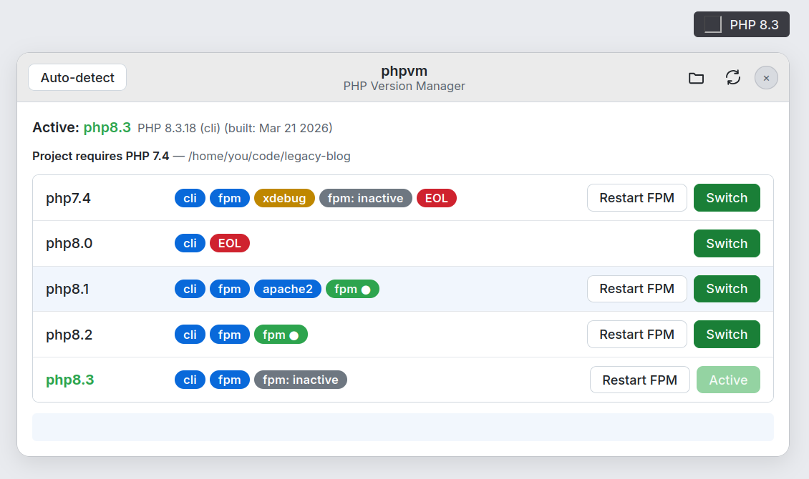
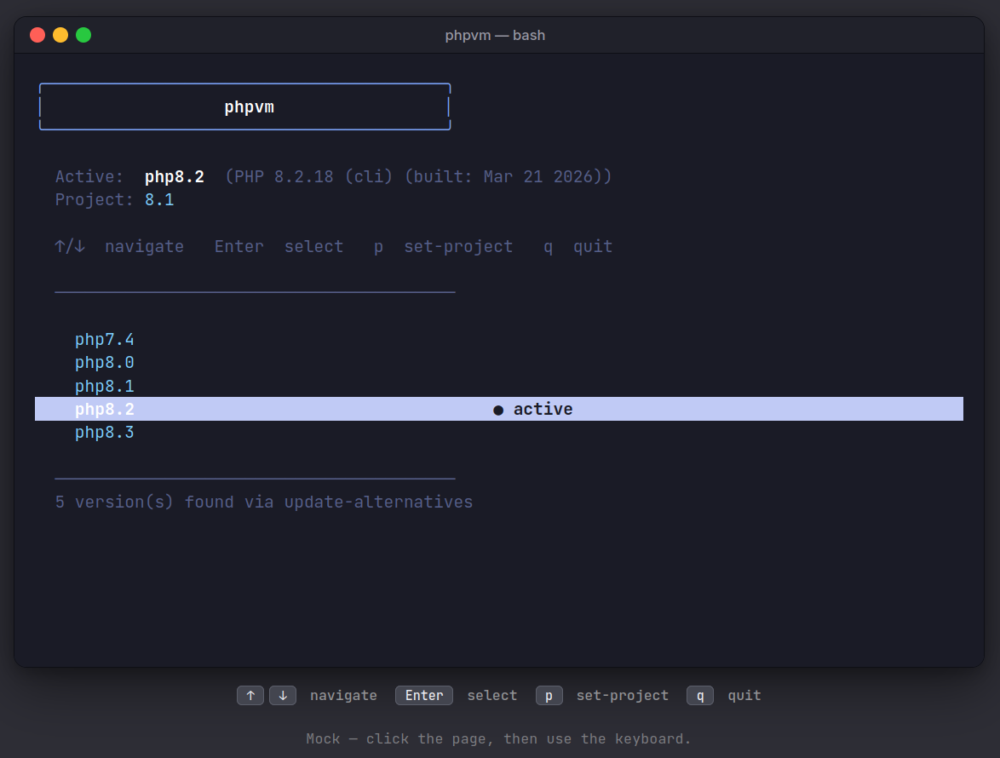
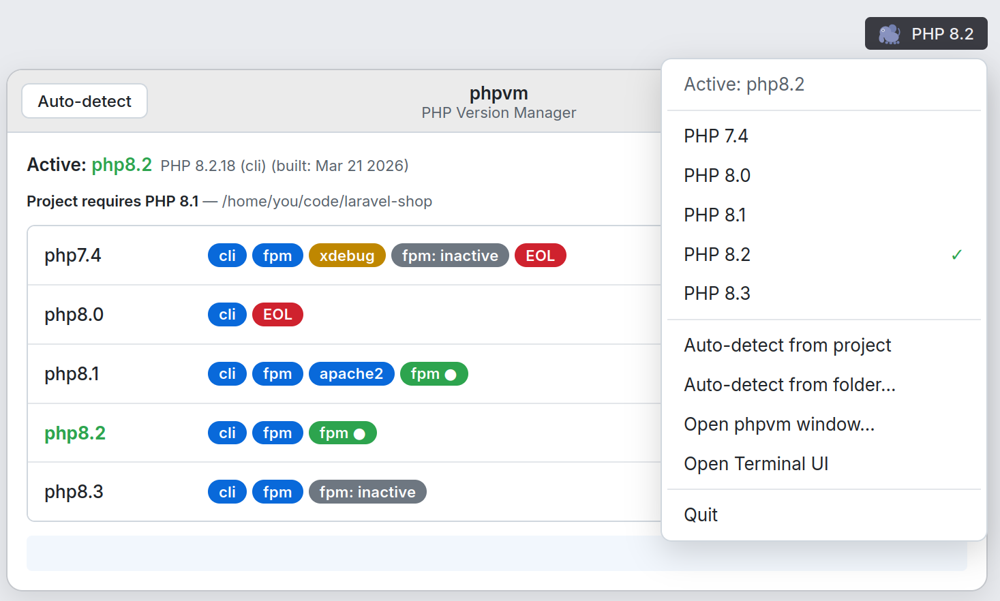

<div align="center">


# phpvm

A small PHP version switcher for Linux. TUI in the terminal, optional system tray app, and a `cd`-hook that picks the right PHP for the project you just stepped into.

If you've been juggling `update-alternatives --set php` by hand every time you switch between a Laravel 9 app on 8.1 and a fresh Symfony repo on 8.3, this is for you.


</div>

<div align="center">
  
  <p><em>One-click switching with SAPI, xdebug, FPM, and EOL badges.</em></p>
</div>

## What it does

- Interactive TUI version picker, arrow keys, Enter, done.
- A tray icon (and a separate GTK window if you'd rather not live in the panel) with per-version badges: which SAPIs are available, whether xdebug is loaded, whether FPM is running, whether the version is EOL.
- `.php-version` (or `composer.json`'s `require.php`) drives a per-project version. Walks up the tree like `nvm` does.
- A `cd`-hook for bash / zsh / fish that runs `phpvm --auto` so the right PHP is loaded by the time the prompt comes back.
- An installer that asks the obvious questions (CLI? GUI? wire up the shell hook? passwordless sudo?) and an uninstaller that backs up your shell rc before touching it.

Under the hood it's just `update-alternatives --set php`. Nothing exotic. The whole point is that you stop typing that command.

## Installing

One-liner (no local clone needed, the installer bootstraps itself by fetching the repo into a temp dir, then cleans up):

```bash
curl -fsSL https://raw.githubusercontent.com/rijoanul-shanto/phpvm/main/install.sh | sudo bash
```

Or clone and run it interactively:

```bash
git clone https://github.com/rijoanul-shanto/phpvm.git
cd phpvm && sudo bash install.sh
```

The installer is interactive even under `curl … | sudo bash`. It reads prompts directly from `/dev/tty` so the pipe doesn't swallow them. Pick CLI, GUI, or both, then say yes/no to the shell hook and the sudoers rule. Falls back to non-interactive defaults only when there is genuinely no controlling terminal (headless CI, `nohup`, etc.).

Pin a specific tag or branch:

```bash
curl -fsSL https://raw.githubusercontent.com/rijoanul-shanto/phpvm/main/install.sh | sudo PHPVM_REF=v2.3.2 bash
```

To remove it, see [Uninstalling](#uninstalling) below.

### Upgrading

```bash
phpvm --self-update
```

That pulls the latest from the repo URL captured at install time and re-runs the installer in `--upgrade` mode, same install paths, same CLI/GUI choice, doesn't re-prompt for sudoers or the shell hook.

If you installed from a tarball (no recorded URL), you can pass one explicitly, optionally with a tag or branch:

```bash
phpvm --self-update https://github.com/rijoanul-shanto/phpvm.git
phpvm --self-update https://github.com/rijoanul-shanto/phpvm.git v2.2.0
```

### What you need

- Linux with `update-alternatives`. Tested on **Ubuntu 20.04 / 22.04 / 24.04** in CI; **Debian 11+** and Ubuntu derivatives (Mint, Pop!_OS, Zorin, elementary) on the equivalent releases should work too.
- Bash 4.3+ (uses `local -n`).
- For the GUI: `python3-gi`, GTK3, AppIndicator3. The install command is in the GUI section below.

## CLI
Keyboard-driven picker right where you live. <kbd>↑</kbd>/<kbd>↓</kbd> to move, <kbd>Enter</kbd> to switch, <kbd>p</kbd> to pin as the project version, <kbd>q</kbd> to bail.



| Command | What it does |
|---|---|
| `phpvm` | Opens the TUI |
| `phpvm --list` | Lists installed PHP versions |
| `phpvm --current` | Prints whichever one is active |
| `phpvm --set 8.2` | Switches globally to 8.2 |
| `phpvm --auto` | Reads `.php-version` / `composer.json` and switches |
| `phpvm --auto --print [dir]` | Prints the resolved project PHP version without switching |
| `phpvm --set-project 8.2` | Writes `.php-version` here |
| `phpvm --enable-hook [shell]` | Adds the auto-switch hook to your rc |
| `phpvm --disable-hook [shell]` | Removes it (rc is backed up first) |
| `phpvm --window` | Launches the GTK picker window, then frees the terminal |
| `phpvm-gui` | Tray applet (see [The GUI](#the-gui)) |
| `phpvm-gui --window` | Standalone GTK picker window, no tray |
| `phpvm --self-update` | Re-runs the installer against the latest commit |
| `phpvm --doctor` | Full diagnostic: CLI install, PHP runtimes, FPM, sudoers, shell hook, GUI, project |
| `phpvm --help` | Everything else |

Vim users get <kbd>k</kbd>/<kbd>j</kbd> too.

## The GUI



Two shapes, same binary.

```bash
sudo apt install python3-gi gir1.2-gtk-3.0 gir1.2-ayatana-appindicator3-0.1

phpvm-gui              # tray applet
phpvm-gui --window     # detached GTK picker window, no tray
phpvm --window         # same window, launched from the shell (terminal freed)
```

The window view shows each version with:

- which SAPIs are available (`cli`, `fpm`, `apache2`)
- whether xdebug is enabled
- whether `php-fpm` for that version is running
- a red marker if it's EOL

Each row gets buttons for **Switch** and **Restart FPM**. There's also a project auto-detect button and a folder picker for one-off switches. Hover a row and the tooltip tells you which `php.ini` it would load.

About FPM restart: it tries passwordless `sudo` first, and if that fails it pops the polkit auth dialog (`pkexec`). Either works; nothing else needed.

## Per-project PHP

```bash
echo "8.1" > .php-version
# or
phpvm --set-project 8.1
```

phpvm walks up the directory tree looking for `.php-version`. If there isn't one, it reads `require.php` from `composer.json` and picks the highest installed version that satisfies the constraint. Caret, tilde, ranges, `|` unions, all the constraint syntaxes Composer accepts.

## Shell hook (auto-switch on `cd`)

The easy way:

```bash
phpvm --enable-hook            # detects $SHELL
phpvm --enable-hook zsh        # or name it
phpvm --disable-hook           # undo, rc backed up
```

<details>
<summary>If you'd rather edit your rc yourself</summary>

System install lives under `/etc/phpvm`; user install lives under `~/.phpvm`. Source whichever exists:

```bash
# bash
source /etc/phpvm/php-auto.bash      # or  ~/.phpvm/php-auto.bash

# zsh
source /etc/phpvm/php-auto.zsh       # or  ~/.phpvm/php-auto.zsh

# fish
source /etc/phpvm/php-auto.fish      # or  ~/.phpvm/php-auto.fish
```

</details>

## About sudo

Every switch ends up running `sudo update-alternatives --set php …` 

By default that means a password prompt. The installer offers to drop a sudoers rule so you don't get one:

```
# /etc/sudoers.d/phpvm
username ALL=(ALL) NOPASSWD: /usr/bin/update-alternatives --set php /usr/bin/php[0-9].[0-9]
```

The glob is intentionally narrow, it matches `php8.2` but not `phpunit` or `php-config`.

If you skip the sudoers rule, the CLI just asks for a password the normal way (and labels the prompt so you know who's asking). The GUI tries passwordless sudo first, then falls back to the polkit dialog.

<details>
<summary>If <code>phpvm</code> reports no versions installed</summary>

You probably haven't registered them with `update-alternatives` yet:

```bash
sudo update-alternatives --install /usr/bin/php php /usr/bin/php8.3 83
sudo update-alternatives --install /usr/bin/php php /usr/bin/php8.2 82
sudo update-alternatives --install /usr/bin/php php /usr/bin/php8.1 81
```

The number at the end is the priority; higher wins when nothing is explicitly selected.

</details>

<details>
<summary>Project layout</summary>

```
phpvm/
├── phpvm.sh           CLI + TUI
├── phpvm-gui.py       tray + window GUI
├── shell/
│   ├── php-auto.bash
│   ├── php-auto.zsh
│   └── php-auto.fish
├── install.sh
└── uninstall.sh
```

</details>

## Uninstalling

One-liner (no local clone needed):

```bash
curl -fsSL https://raw.githubusercontent.com/rijoanul-shanto/phpvm/main/uninstall.sh | sudo bash
```

Or from a local clone:

```bash
sudo bash uninstall.sh
```

What it removes:

- `phpvm` and `phpvm-gui` binaries from both `/usr/local/bin` and `~/.local/bin`
- Hook directory (`/etc/phpvm` or `~/.phpvm`)
- Sudoers rule (`/etc/sudoers.d/phpvm`)
- Desktop entry and autostart file
- Icon from the hicolor theme (and refreshes the icon cache)
- The `source …/php-auto.*` lines from `~/.bashrc`, `~/.zshrc`, and `~/.config/fish/config.fish`

Shell RCs are backed up as `<file>.phpvm-backup` before any edits. Running under `sudo` also cleans the invoking user's home, not just root's.

## Things it won't do

- Install PHP for you. You still need `apt install php8.2 php8.2-fpm …` (or Ondřej Surý's PPA). phpvm only switches between what's already on disk.
- Work on distros without `update-alternatives`. Arch, Fedora, RHEL, openSUSE out of scope. Patches welcome if you want to add a backend.
- Touch your web server config. Apache/Nginx still point at whatever socket or module you wired up. FPM restart is per-version and only knows `systemctl restart phpX.Y-fpm` style unit names.
- Pin a specific patch version. Everything is `X.Y`. If you need `8.2.13` exactly, this is the wrong tool.
- Cross-shell auto-switching inside a single session. Open a new shell after switching to pick up the change inside that shell's `$PATH` resolved binary cache.
- Pop the polkit dialog without a desktop session. Headless boxes get the regular `sudo` password prompt instead.

## Contributing

Patches welcome. See [CONTRIBUTING.md](CONTRIBUTING.md). Two ground rules: no runtime dependencies beyond what's already there, and `shellcheck` clean.

## License

[MIT](LICENSE)
